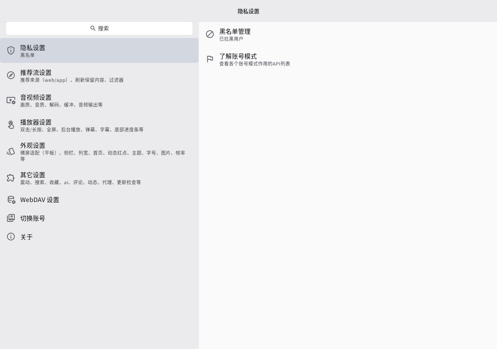
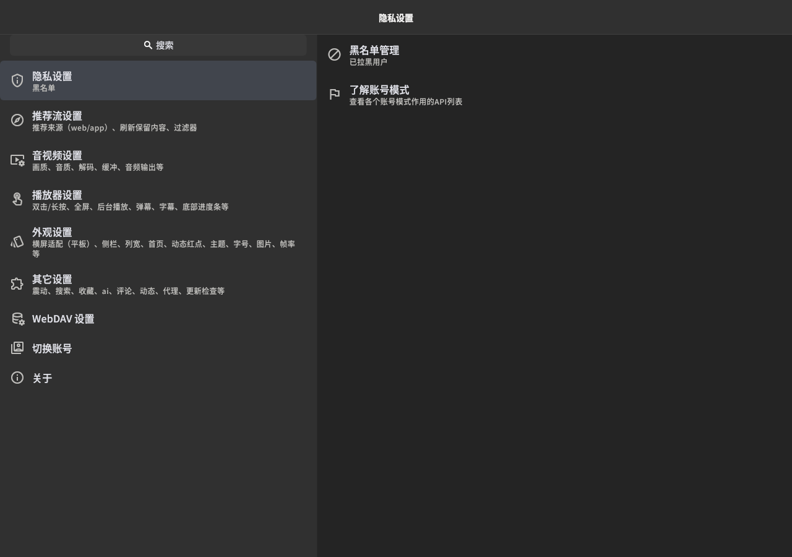

# GNOME presentation fork

Upstream baseline: `41ccd5801a496a13595f9ab4748e2ec6a064ccbc`. Branch: `gnome-ui`.

## Scope and architecture

Linux uses GNOME-style neutral surfaces, a header bar, a labelled scrollable
sidebar, restrained rectangular controls and boxed panels. The original Flutter
widgets retain their event handling, focus, selection, accessibility semantics
and hit targets. This is a Flutter adaptation of the GNOME design language;
it does not replace the renderer with GTK/libadwaita.

The platform boundary is `GnomeTheme.enabled`. Android, iOS, macOS and Windows
retain the upstream theme and navigation. Existing accent selection, custom
fonts/weights, theme mode and OLED preference remain effective. Existing narrow
window navigation and user-configured navigation destinations/order are retained.

`lib/utils/gnome_theme.dart` decorates the upstream theme. It does not replace
routing, playback, accounts, HTTP, persistence or plugin implementations.
`lib/utils/gnome_sidebar.dart` uses the original destination callbacks.

## Validation

Local SDK: official Flutter 3.47.4 / Dart 3.13.3. 6 core/sidebar tests plus 4 real settings-page tests passed.
Static analysis has no errors or warnings; upstream informational lints remain.

The real page render tests cover light/dark and narrow/wide layouts. Kazumi's
personal-center test activates every destination; PiliPlus checks every settings
entry and switches the real desktop split pane. The sidebar tests cover pointer,
keyboard and scrolling at enlarged text size. Font, accent and OLED preferences,
and the non-Linux platform boundary have explicit tests.

Run the normal upstream tests with `flutter test --no-pub`. The GNOME Linux
workflow applies upstream setup and produces a release bundle after analysis
and tests. Do not interpret widget tests as complete live-service validation.

## Remaining manual acceptance

- Log in with a real account, log out, switch accounts and restore sessions.
- Play live/online/local video, subtitles and danmaku; exercise every shortcut,
  seek/volume/brightness gesture, fullscreen, picture-in-picture and casting.
- Check search, history, favourites/follows, downloads, backups and restore.
- Verify all settings persist across restart, including custom navigation and fonts.
- Check GNOME scaling, assistive technologies, window controls and small windows.
- Exercise account-dependent, region-dependent and upstream API-key-dependent features.

No claim of complete functionality/usage-habit equivalence is made before this
manual acceptance is performed. Existing upstream code and tests are preserved.

## Design reference

[GNOME HIG](https://developer.gnome.org/hig/), including
[header bars](https://developer.gnome.org/hig/patterns/containers/header-bars.html).

The upstream license and attribution remain unchanged.

PiliPlus requires its upstream `lib/scripts/patch.ps1 Linux` framework and
`material_ui` patches before analysis/build. A stock Flutter SDK alone is not a
valid substitute. Local verification used isolated patched copies in `work/`;
CI runs the existing upstream script on its disposable runner.

## Page render previews

These are renders of real application widgets in regression tests with isolated
fixture data, not screenshots of a signed-in user session. Both light and dark
screens are tested at narrow and wide widths.

